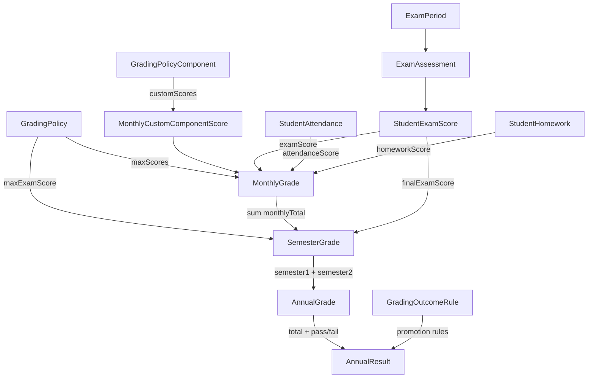

# 📊 تقرير تحليل شامل — نظام التعليم والدرجات (Education & Grading System)
## تاريخ التقرير: 2026-03-24

---

## 1. 🧠 فهم النظام الحالي (Current System Understanding)

### كيف يعمل النظام حالياً؟

النظام مبني على بنية **NestJS + Prisma + MySQL** في الباك إند و**Next.js + TypeScript** في الفرونت إند. يتبع نمط CRUD مع حسابات مجمّعة (Batch Calculate) على مستوى الشهر والفصل والعام.

### الكيانات الأساسية

| الكيان | الغرض | عدد أسطر الكود |
|---|---|---|
| [GradingPolicy](file:///C:/Users/mousa/Desktop/New%20folder/backend-frontend/backend/src/modules/monthly-grades/monthly-grades.service.ts#25-33) | سياسة التقييم — تحدد أوزان المكونات (حضور، واجبات، اختبار، نشاط، مشاركة) | ~430 سطر (مكرر!) |
| `GradingPolicyComponent` | مكونات مخصصة إضافية للسياسة (سلوك، مشروع...) | ~300 سطر |
| [ExamPeriod](file:///C:/Users/mousa/Desktop/New%20folder/backend-frontend/backend/src/modules/exams/exam-periods/exam-periods.service.ts#59-421) | الفترة الاختبارية — تحدد نطاق زمني للاختبارات (شهرية/نهائية) | ~420 سطر |
| [ExamAssessment](file:///C:/Users/mousa/Desktop/New%20folder/backend-frontend/backend/src/modules/exams/exam-assessments/exam-assessments.service.ts#66-485) | تقييم محدد — اختبار بعينه داخل فترة (مادة + شعبة + تاريخ) | ~486 سطر |
| `StudentExamScore` | درجة الطالب في تقييم محدد | متوسط |
| [MonthlyGrade](file:///C:/Users/mousa/Desktop/New%20folder/backend-frontend/backend/src/modules/monthly-grades/monthly-grades.service.ts#193-1475) | المحصلة الشهرية — تجميع (حضور + واجبات + اختبار + نشاط + مشاركة + مخصص) | **1475 سطر** |
| [SemesterGrade](file:///C:/Users/mousa/Desktop/New%20folder/backend-frontend/backend/src/modules/semester-grades/semester-grades.service.ts#118-1352) | الدرجة الفصلية — مجموع المحصلات الشهرية + درجة الاختبار النهائي | **1352 سطر** |
| [AnnualGrade](file:///C:/Users/mousa/Desktop/New%20folder/backend-frontend/backend/src/modules/annual-grades/annual-grades.service.ts#21-26) | الدرجة السنوية — فصل أول + فصل ثاني لكل مادة | ~902 سطر |
| [AnnualResult](file:///C:/Users/mousa/Desktop/New%20folder/backend-frontend/backend/src/modules/annual-results/annual-results.service.ts#124-1532) | النتيجة السنوية — إجمالي جميع المواد + ترتيب + قرار ترفيع | **1532 سطر** |
| `GradingOutcomeRule` | قواعد الترفيع — عدد المواد المسموح الرسوب فيها | ~300 سطر |
| [PolicyResolver](file:///C:/Users/mousa/Desktop/New%20folder/backend-frontend/backend/src/modules/evaluation-policies/grading-policies/policy-resolver.service.ts#20-97) | محرك اختيار السياسة المناسبة حسب السياق | 97 سطر |
| [GradingReports](file:///C:/Users/mousa/Desktop/New%20folder/backend-frontend/backend/src/modules/grading-reports/grading-reports.service.ts#24-725) | تقارير إحصائية مجمّعة | 725 سطر |

### كيف ترتبط الكيانات ببعضها؟



### هل التصميم واضح أم عشوائي؟

- **التصميم هرمي واضح المفهوم** (شهري ← فصلي ← سنوي)
- **لكنه يعاني من تكرار وتداخل في المفاهيم** — توجد نسختان من [GradingPoliciesService](file:///C:/Users/mousa/Desktop/New%20folder/backend-frontend/backend/src/modules/evaluation-policies/grading-policies/grading-policies.service.ts#64-428) بلا مبرر
- **الربط بين Policy والحسابات ضعيف** — كل خدمة تبحث عن السياسة بطريقتها الخاصة
- **المسؤوليات غير واضحة** — [PolicyResolverService](file:///C:/Users/mousa/Desktop/New%20folder/backend-frontend/backend/src/modules/evaluation-policies/grading-policies/policy-resolver.service.ts#20-97) موجود لكن لا يُستخدم فعلياً في حسابات الدرجات الشهرية أو الفصلية

---

## 2. 🔄 تحليل التدفق (Workflow Analysis)

### التسلسل الفعلي للعمليات

```
الخطوة 1: إعداد سياسة التقييم (GradingPolicy)
   ├ تحديد الأوزان: حضور، واجبات، اختبار، نشاط، مشاركة
   ├ تحديد نوع التقييم: MONTHLY أو FINAL
   └ ربطها بـ (سنة + صف + مادة)

الخطوة 2: إنشاء فترة اختبارية (ExamPeriod)
   ├ تحديد النوع: MONTHLY أو FINAL
   └ ربطها بـ (سنة + فصل)

الخطوة 3: إنشاء تقييمات (ExamAssessment)
   ├ ربطها بـ (فترة + شعبة + مادة + تاريخ)
   └ تحديد الدرجة العظمى

الخطوة 4: إدخال درجات الطلاب (StudentExamScore) — يدوي

الخطوة 5: إدخال الواجبات (Homework) + تسجيل الحضور

الخطوة 6: حساب المحصلة الشهرية (calculate) — زر يدوي
   ← يحسب تلقائياً: حضور + واجبات + اختبارات
   ← يدوي: نشاط + مشاركة

الخطوة 7: حساب الدرجة الفصلية (calculate) — زر يدوي
   ← يجمع كل المحصلات الشهرية لنفس الفصل

الخطوة 8: تعبئة درجة الاختبار النهائي (fillFinalExamScores) — زر يدوي

الخطوة 9: حساب الدرجة السنوية + النتيجة + الترتيب (calculate) — زر يدوي
```

### 🚨 مشاكل التدفق

| المشكلة | التأثير |
|---|---|
| **لا يوجد ترتيب إجباري للخطوات** | يمكن حساب الدرجة الفصلية قبل وجود محصلات شهرية → النتيجة = 0 |
| **لا يوجد تحقق من اكتمال البيانات** | يمكن حساب النتيجة السنوية حتى لو فصل واحد فقط مسجّل |
| **الخطوة 8 مستقلة عن 7** | يمكن تعبئة درجة النهائي بدون حساب أعمال الفصل أولاً |
| **لا يوجد تسلسل Workflow رسمي** | حقل `status` موجود (DRAFT/IN_REVIEW/APPROVED/ARCHIVED) لكنه لا يتحكم في التدفق — فقط metadata |
| **عمليات الحساب كلها يدوية** | لا يوجد أي trigger أو scheduled job — كل شيء بضغط زر |
| **لا يوجد إشعار بنقص البيانات** | إذا لم تُسجَّل درجات اختبارات لشهر معين، يُحسب صفر بدون تنبيه |

---

## 3. ❌ الأخطاء البرمجية (Bugs & Failures)

### خطأ 1: تكرار كامل لخدمة [GradingPoliciesService](file:///C:/Users/mousa/Desktop/New%20folder/backend-frontend/backend/src/modules/evaluation-policies/grading-policies/grading-policies.service.ts#64-428)

- يوجد ملف [grading-policies.service.ts](file:///C:/Users/mousa/Desktop/New%20folder/backend-frontend/backend/src/modules/grading-policies/grading-policies.service.ts) (مستقل)
- ويوجد ملف مطابق تقريباً في [evaluation-policies/grading-policies/grading-policies.service.ts](file:///C:/Users/mousa/Desktop/New%20folder/backend-frontend/backend/src/modules/evaluation-policies/grading-policies/grading-policies.service.ts)
- **الاختلافات**: النسخة في `evaluation-policies` تدعم `assessmentTypeLookupId` و `academicTermId` في الفلترة، بينما النسخة المستقلة لا تدعمهما
- **التأثير**: ازدواجية كود خطيرة — أي إصلاح في نسخة لا ينعكس على الأخرى

### خطأ 2: [PolicyResolverService](file:///C:/Users/mousa/Desktop/New%20folder/backend-frontend/backend/src/modules/evaluation-policies/grading-policies/policy-resolver.service.ts#20-97) موجود لكن غير مستخدم فعلياً

- الملف [policy-resolver.service.ts](file:///C:/Users/mousa/Desktop/New%20folder/backend-frontend/backend/src/modules/evaluation-policies/grading-policies/policy-resolver.service.ts) يحتوي على منطق ذكي لاختيار السياسة
- لكن [MonthlyGradesService](file:///C:/Users/mousa/Desktop/New%20folder/backend-frontend/backend/src/modules/monthly-grades/monthly-grades.service.ts#193-1475) و [SemesterGradesService](file:///C:/Users/mousa/Desktop/New%20folder/backend-frontend/backend/src/modules/semester-grades/semester-grades.service.ts#118-1352) يستخدمان [findMonthlyPolicy](file:///C:/Users/mousa/Desktop/New%20folder/backend-frontend/backend/src/modules/monthly-grades/monthly-grades.service.ts#1134-1212) الخاص بهما مباشرة ولا يستدعيان [PolicyResolverService](file:///C:/Users/mousa/Desktop/New%20folder/backend-frontend/backend/src/modules/evaluation-policies/grading-policies/policy-resolver.service.ts#20-97)
- **التأثير**: منطق اختيار السياسة مختلف بين الخدمات — قد تُختار سياسة مختلفة لنفس السياق

### خطأ 3: N+1 Query داخل الـ Transaction في [calculate](file:///C:/Users/mousa/Desktop/New%20folder/backend-frontend/backend/src/modules/monthly-grades/monthly-grades.service.ts#316-516)

- في [monthly-grades.service.ts:402-496](file:///C:/Users/mousa/Desktop/New%20folder/backend-frontend/backend/src/modules/monthly-grades/monthly-grades.service.ts#L402-L496): حلقة `for` على كل enrollment → تستدعي [computeAutoScores](file:///C:/Users/mousa/Desktop/New%20folder/backend-frontend/backend/src/modules/monthly-grades/monthly-grades.service.ts#1213-1360) (4 استعلامات) + create/update = **5-6 استعلامات لكل طالب**
- فصل فيه 30 طالب ← **~180 استعلام** في transaction واحدة
- **التأثير**: بطء شديد + احتمال timeout على الـ transaction

### خطأ 4: N+1 في حساب الترتيب السنوي

- في [annual-results.service.ts:965-975](file:///C:/Users/mousa/Desktop/New%20folder/backend-frontend/backend/src/modules/annual-results/annual-results.service.ts#L965-L975): حلقة `for` تعمل [update](file:///C:/Users/mousa/Desktop/New%20folder/backend-frontend/backend/src/modules/annual-results/annual-results.service.ts#339-437) منفصل لكل طالب لتحديث `rankInClass`
- ثم حلقة ثانية لـ `rankInGrade` (سطور 1008-1018)
- **التأثير**: 60 طالب في الفصل ← 60 UPDATE + 60 UPDATE أخرى = 120 استعلام إضافي

### خطأ 5: [validateScoreRules](file:///C:/Users/mousa/Desktop/New%20folder/backend-frontend/backend/src/modules/evaluation-policies/grading-policies/grading-policies.service.ts#382-406) مختلفة بين النسختين

- النسخة المستقلة تتحقق `totalMaxScore <= 100` (hardcoded)
- نسخة `evaluation-policies` تتحقق فقط `>= 0`
- **التأثير**: سلوك مختلف حسب أي endpoint يُستخدم

### خطأ 6: [decimalToNumber](file:///C:/Users/mousa/Desktop/New%20folder/backend-frontend/backend/src/modules/semester-grades/semester-grades.service.ts#1302-1311) تُرجع `undefined` وليس `0`

- كل الخدمات تستخدم `this.decimalToNumber(value) ?? 0`
- لكن في بعض الأماكن يُستخدم `this.decimalToNumber(existing?.finalExamScore) !== undefined` (سطر 527 في semester-grades)
- `null` من قاعدة البيانات ← `undefined` من الدالة ← يعني "لا توجد درجة"
- لكن فعلياً `null` و `0` يجب أن يكونا مختلفين (0 = حاضر ولم يحصل على شيء، null = لم يُدخل بعد)
- **التأثير**: التفريق بين "لم يُدخل" و "صفر" غير واضح في كل الأماكن

### خطأ 7: عدم التحقق من `assessmentTypeLookupId` في [update](file:///C:/Users/mousa/Desktop/New%20folder/backend-frontend/backend/src/modules/annual-results/annual-results.service.ts#339-437)

- في نسخة `evaluation-policies` من `GradingPoliciesService.update()` ← لا يُمرَّر `assessmentTypeLookupId` في `data`
- **التأثير**: لا يمكن تحديث نوع التقييم عبر الـ lookup

---

## 4. 🗄️ مشاكل قاعدة البيانات (Database Issues)

### مشكلة 1: عدم وجود ربط بين [MonthlyGrade](file:///C:/Users/mousa/Desktop/New%20folder/backend-frontend/backend/src/modules/monthly-grades/monthly-grades.service.ts#193-1475) و [SemesterGrade](file:///C:/Users/mousa/Desktop/New%20folder/backend-frontend/backend/src/modules/semester-grades/semester-grades.service.ts#118-1352)

- لا يوجد foreign key من [SemesterGrade](file:///C:/Users/mousa/Desktop/New%20folder/backend-frontend/backend/src/modules/semester-grades/semester-grades.service.ts#118-1352) إلى [MonthlyGrade](file:///C:/Users/mousa/Desktop/New%20folder/backend-frontend/backend/src/modules/monthly-grades/monthly-grades.service.ts#193-1475)
- الربط يتم عبر **استعلام aggregate** يبحث بـ [(studentEnrollmentId, subjectId, academicTermId)](file:///C:/Users/mousa/Desktop/New%20folder/backend-frontend/backend/src/modules/monthly-grades/monthly-grades.service.ts#756-794)
- **التأثير**: لا يمكن تتبع أي محصلات شهرية ساهمت في الدرجة الفصلية

### مشكلة 2: جمع المحصلات الشهرية بدون تطبيع (Normalization)

- [sumMonthlyTotals](file:///C:/Users/mousa/Desktop/New%20folder/backend-frontend/backend/src/modules/semester-grades/semester-grades.service.ts#1210-1231) في [semester-grades.service.ts:1210-1230](file:///C:/Users/mousa/Desktop/New%20folder/backend-frontend/backend/src/modules/semester-grades/semester-grades.service.ts#L1210-L1230) يجمع `monthlyTotal` مباشرة
- إذا السياسة تحدد المحصلة الشهرية من 30 (وليس 100)، والفصل فيه 3 أشهر ← semesterWorkTotal = 90 (وهو رقم لا يعني شيئاً)
- **لا يوجد تطبيع بحسب عدد الأشهر أو الدرجة العظمى للفصل**
- **التأثير**: نتائج حسابية خاطئة إذا المحصلة الشهرية ليست من 100

### مشكلة 3: `annualTotal` = مجرد جمع فصلين بدون تطبيع

- [computeAnnualTotal](file:///C:/Users/mousa/Desktop/New%20folder/backend-frontend/backend/src/modules/annual-grades/annual-grades.service.ts#840-843) = `semester1Total + semester2Total`
- لا يوجد أي وزن أو تطبيع
- **التأثير**: إذا الفصل الأول من 150 والثاني من 150 ← annualTotal = 300 (بدون معنى نسبي)

### مشكلة 4: حساب `maxAnnual` في [buildPolicyMetaMap](file:///C:/Users/mousa/Desktop/New%20folder/backend-frontend/backend/src/modules/annual-results/annual-results.service.ts#1322-1426) يفترض فصلين متطابقين

- `maxAnnual = oneSemesterMax * 2`
- **التأثير**: لو الفصل الأول يختلف عن الثاني في المكونات، الحساب خاطئ

### مشكلة 5: حساب `annualPercentage` في [AnnualGradesService](file:///C:/Users/mousa/Desktop/New%20folder/backend-frontend/backend/src/modules/annual-grades/annual-grades.service.ts#114-902) يعتمد على سياسة MONTHLY

- [computeAnnualPercentage](file:///C:/Users/mousa/Desktop/New%20folder/backend-frontend/backend/src/modules/annual-grades/annual-grades.service.ts#757-839) يبحث عن سياسة `AssessmentType.MONTHLY` لحساب النسبة السنوية
- **لكن النسبة السنوية يجب أن تأخذ بالحسبان وزن الاختبار النهائي**
- **التأثير**: النسبة السنوية محسوبة على أساس أوزان المحصلة الشهرية فقط، متجاهلة وزن الاختبار النهائي

### مشكلة 6: الحذف الناعم (Soft Delete) بدون CASCADE على العناصر المرتبطة

- حذف [MonthlyGrade](file:///C:/Users/mousa/Desktop/New%20folder/backend-frontend/backend/src/modules/monthly-grades/monthly-grades.service.ts#193-1475) → يحذف أيضاً `MonthlyCustomComponentScore` (سطور 849-871) ✅
- لكن حذف [SemesterGrade](file:///C:/Users/mousa/Desktop/New%20folder/backend-frontend/backend/src/modules/semester-grades/semester-grades.service.ts#118-1352) → **لا يؤثر على MonthlyGrade** ⚠️
- حذف [ExamAssessment](file:///C:/Users/mousa/Desktop/New%20folder/backend-frontend/backend/src/modules/exams/exam-assessments/exam-assessments.service.ts#66-485) → **لا يحذف StudentExamScore** ⚠️
- **التأثير**: بيانات يتيمة (orphaned data) قد تبقى وتؤثر على الحسابات

---

## 5. ⚠️ مشاكل منطقية (Logical Issues)

### مشكلة 1: تعريف "السياسة" مبهم

- [GradingPolicy](file:///C:/Users/mousa/Desktop/New%20folder/backend-frontend/backend/src/modules/monthly-grades/monthly-grades.service.ts#25-33) تحمل `assessmentType` (MONTHLY/FINAL) + `assessmentTypeLookupId` (مرن)
- **لكن** العلاقة غير واضحة: هل كل مادة تحتاج سياستين (MONTHLY + FINAL)؟ وماذا لو أردت وزناً مختلفاً للاختبار النهائي؟
- **النظام الحالي يجيب**: نعم، لكل مادة سياسة MONTHLY وأخرى FINAL — **لكن لا يوجد ربط بينهما لتحديد وزن الاختبار النهائي مقابل أعمال الفصل**

### مشكلة 2: مفهوم "الفترة" بين Exam وMonthly مبهم

- [ExamPeriod](file:///C:/Users/mousa/Desktop/New%20folder/backend-frontend/backend/src/modules/exams/exam-periods/exam-periods.service.ts#59-421) لها `assessmentType: MONTHLY | FINAL`
- [GradingPolicy](file:///C:/Users/mousa/Desktop/New%20folder/backend-frontend/backend/src/modules/monthly-grades/monthly-grades.service.ts#25-33) أيضاً لها `assessmentType: MONTHLY | FINAL`
- **السؤال**: هل ExamPeriod من نوع MONTHLY مرتبطة بشهر محدد؟ **لا** — هي فقط فترة زمنية
- **التأثير**: يمكن إنشاء اختبار شهري في فترة اختبارية لا تقع ضمن الشهر الأكاديمي

### مشكلة 3: `passingScore` في [GradingPolicy](file:///C:/Users/mousa/Desktop/New%20folder/backend-frontend/backend/src/modules/monthly-grades/monthly-grades.service.ts#25-33) — ماذا يعني؟

- هل هو درجة النجاح في المحصلة الشهرية؟ أم في المادة ككل؟
- في [AnnualGradesService](file:///C:/Users/mousa/Desktop/New%20folder/backend-frontend/backend/src/modules/annual-grades/annual-grades.service.ts#114-902) يُستخدم كنسبة مئوية: `annualPercentage >= policyMeta.passingScore`
- **لكنه يُعرّف في سياسة MONTHLY** بينما يُكتب كأنه نسبة سنوية
- **التأثير**: خلط مفاهيم — "درجة النجاح" معناها مختلف حسب السياق

### مشكلة 4: تحديد النجاح/الرسوب في `AnnualResult.calculate` يعتمد على `annualPercentage`

- `annualPercentage >= passingScore` ← ناجح
- **لكن** `passingScore` مأخوذ من سياسة MONTHLY، وهو عادة رقم مثل 50 (من 100)
- وال `annualPercentage` قد تكون من 0 إلى 100 (نسبة مئوية)
- **التأثير**: قد يعمل بالصدفة لأن كلا الرقمين من 100، لكن المفهوم خاطئ

### مشكلة 5: [computeSemesterTotal](file:///C:/Users/mousa/Desktop/New%20folder/backend-frontend/backend/src/modules/semester-grades/semester-grades.service.ts#1287-1293) = مجرد جمع

- `semesterTotal = semesterWorkTotal + finalExamScore`
- **لا يوجد أي تطبيع بحسب الأوزان**
- إذا أعمال الفصل من 60 والنهائي من 40 ← semesterTotal = 100 ← صحيح
- لكن إذا أعمال الفصل من 90 (3 أشهر × 30) والنهائي من 40 ← semesterTotal = 130 ← **خاطئ**

---

## 6. 🧩 مشاكل التصميم (Design Problems)

### ازدواجية الوحدات (Module Duplication)

| المسار | الغرض |
|---|---|
| `modules/grading-policies/` | خدمة مستقلة لسياسات الدرجات |
| `modules/evaluation-policies/grading-policies/` | **نفس الخدمة** مع اختلافات طفيفة |
| `modules/grading-outcome-rules/` | خدمة مستقلة لقواعد الترفيع |
| `modules/evaluation-policies/grading-outcome-rules/` | **نفس الخدمة** مرة أخرى |

> [!CAUTION]
> هذا التكرار يعني أن هناك **4 endpoints** لنفس العملية — وأي تعديل يجب أن يُطبّق في مكانين مختلفين.

### تكرار الشيفرات المساعدة (Helper Duplication)

الدوال التالية مكررة **حرفياً** في كل ملف:
- [decimalToNumber()](file:///C:/Users/mousa/Desktop/New%20folder/backend-frontend/backend/src/modules/semester-grades/semester-grades.service.ts#1302-1311) — مكررة في 5+ خدمات
- [round2()](file:///C:/Users/mousa/Desktop/New%20folder/backend-frontend/backend/src/modules/semester-grades/semester-grades.service.ts#1312-1315) — مكررة في 4+ خدمات
- [throwKnownDatabaseErrors()](file:///C:/Users/mousa/Desktop/New%20folder/backend-frontend/backend/src/modules/monthly-grades/monthly-grades.service.ts#1454-1466) — مكررة في 10+ خدمات
- [extractErrorMessage()](file:///C:/Users/mousa/Desktop/New%20folder/backend-frontend/backend/src/modules/semester-grades/semester-grades.service.ts#1344-1351) — مكررة في 10+ خدمات
- [ensureSubjectExistsAndActive()](file:///C:/Users/mousa/Desktop/New%20folder/backend-frontend/backend/src/modules/exams/exam-assessments/exam-assessments.service.ts#401-421) — مكررة في 4+ خدمات
- [ensureActorAuthorized()](file:///C:/Users/mousa/Desktop/New%20folder/backend-frontend/backend/src/modules/monthly-grades/monthly-grades.service.ts#1439-1453) — مكررة في 3+ خدمات

### Tight Coupling بين الخدمات

- `MonthlyGradesService.findMonthlyPolicy()` يبحث مباشرة في `gradingPolicy` — لا يستخدم [PolicyResolverService](file:///C:/Users/mousa/Desktop/New%20folder/backend-frontend/backend/src/modules/evaluation-policies/grading-policies/policy-resolver.service.ts#20-97)
- `SemesterGradesService.findFinalPolicyMaxExamScore()` أيضاً يبحث مباشرة
- `AnnualGradesService.computeAnnualPercentage()` أيضاً يبحث مباشرة
- `AnnualResultsService.buildPolicyMetaMap()` أيضاً يبحث مباشرة
- **كل خدمة تبحث عن السياسة بطريقتها الخاصة ← 4 طرق مختلفة**

### عدم قابلية التوسع (Scalability)

| الجانب | الحالة |
|---|---|
| إضافة مكون شهري جديد (مثل "مشروع") | ❌ يتطلب تعديل schema + service + frontend |
| دعم أكثر من فصلين | ❌ hardcoded `sequence === 1` و `sequence === 2` |
| إضافة نوع تقييم جديد | ⚠️ يتطلب تعديل enum + كل الخدمات المعتمدة عليه |
| دعم مدرسة بنظام مختلف | ❌ الأوزان ثابتة في الكود |

---

## 7. 🔐 مشاكل التحقق (Validation & Integrity)

### ✅ ما يعمل

| التحقق | الحالة |
|---|---|
| منع التكرار (unique record) | ✅ يتحقق قبل الإنشاء + يلتقط P2002 |
| التحقق من وجود المراجع (FK) | ✅ يتحقق من enrollment, subject, month, term |
| التحقق من قيد الطالب نشط | ✅ |
| التحقق من الصلاحيات (DataScope) | ✅ في monthly-grades و semester-grades |
| منع تعديل السجلات المقفلة | ✅ |
| التحقق من تاريخ الاختبار ضمن الفترة | ✅ |

### ❌ ما لا يعمل

| التحقق المفقود | التأثير |
|---|---|
| **لا يتحقق من مجموع أوزان السياسة = 100** | يمكن إنشاء سياسة بأوزان مجموعها 50 أو 200 |
| **لا يتحقق من اكتمال الدرجات قبل الحساب** | يمكن حساب فصلي بدون أي شهري |
| **لا يتحقق من وجود سياسة FINAL عند حساب الفصلي** | إذا لم توجد ← يستخدم `scored.max` مباشرة (fallback غير واضح) |
| **لا يمنع إدخال درجة أعلى من maxScore في ExamAssessment** | التحقق يتم فقط على `score >= 0`، لا يقارن بـ `maxScore` |
| **لا يتحقق من تطابق الشعبة بين enrollment و examAssessment** | يمكن إدخال درجة لطالب ليس في نفس الشعبة |
| **لا يتحقق من عدد الأشهر المتوقع في الفصل** | يمكن أن يكون فصل فيه 5 أشهر بدون أي تحذير |

---

## 8. ⚡ مشاكل الأداء (Performance)

### مشكلة 1: N+1 Query في `MonthlyGradesService.calculate()`

- لكل طالب: [computeAutoScores()](file:///C:/Users/mousa/Desktop/New%20folder/backend-frontend/backend/src/modules/monthly-grades/monthly-grades.service.ts#1213-1360) = **4 استعلامات** (attendance count × 2 + homework findMany + exam findMany)
- ثم [sumCustomComponentScores()](file:///C:/Users/mousa/Desktop/New%20folder/backend-frontend/backend/src/modules/monthly-grades/monthly-grades.service.ts#1361-1385) = **1 استعلام**
- ثم create/update = **1 استعلام**
- **المجموع**: ~6 استعلامات × عدد الطلاب
- **30 طالب = ~180 استعلام في transaction واحدة**

### مشكلة 2: N+1 في ترتيب الطلاب السنوي

- `AnnualResultsService.calculate()` يعمل UPDATE واحد لكل طالب لتحديث الترتيب
- يمكن استبداله بـ `updateMany` أو استعلام SQL واحد

### مشكلة 3: تحميل بيانات زائدة في `include`

- `monthlyGradeInclude` يُحمَّل دائماً مع **كل** المكونات المخصصة + تفاصيل الطالب + الشعبة + المادة + السنة + الفصل + الشهر + السياسة + المنشئ + المحدّث + القافل
- هذا يحدث حتى في عمليات القائمة ([findAll](file:///C:/Users/mousa/Desktop/New%20folder/backend-frontend/backend/src/modules/exams/exam-assessments/exam-assessments.service.ts#132-209)) حيث لا نحتاج كل هذه التفاصيل

### مشكلة 4: `GradingReportsService.getSummary()` يُنفّذ 17 استعلاماً متوازياً

- ليست كلها ضرورية — يمكن دمج بعضها

### مشكلة 5: عدم وجود فهارس مُحسّنة

- الاستعلامات تبحث بـ [(studentEnrollmentId, subjectId, academicMonthId, deletedAt)](file:///C:/Users/mousa/Desktop/New%20folder/backend-frontend/backend/src/modules/monthly-grades/monthly-grades.service.ts#756-794) — يحتاج composite index
- لا توجد معلومات عن الفهارس الموجودة فعلياً

---

## 9. 🔗 مشاكل التكامل (Integration Issues)

### Frontend ↔ Backend

- **الفرونت إند يحتوي على ازدواجية مماثلة**:
  - `features/grading-policies/` و `features/evaluation-policies/grading-policies/` — نفس الوحدة مرتين
  - `features/grading-outcome-rules/` و `features/evaluation-policies/grading-outcome-rules/`
  - `features/annual-grades/` و `features/grade-aggregation/annual-grades/`
  - `features/monthly-grades/` و `features/grade-aggregation/monthly-grades/`
  - `features/semester-grades/` و `features/grade-aggregation/semester-grades/`
- **التأثير**: المستخدم قد يرى واجهتين مختلفتين لنفس البيانات

### اختلاف الصلاحيات بين الوحدات

- [MonthlyGradesService](file:///C:/Users/mousa/Desktop/New%20folder/backend-frontend/backend/src/modules/monthly-grades/monthly-grades.service.ts#193-1475) و [SemesterGradesService](file:///C:/Users/mousa/Desktop/New%20folder/backend-frontend/backend/src/modules/semester-grades/semester-grades.service.ts#118-1352) يستخدمان `DataScopeService`
- [AnnualResultsService](file:///C:/Users/mousa/Desktop/New%20folder/backend-frontend/backend/src/modules/annual-results/annual-results.service.ts#124-1532) يستخدم نظام صلاحيات مختلف تماماً ([ensureActorAuthorizedForSection](file:///C:/Users/mousa/Desktop/New%20folder/backend-frontend/backend/src/modules/annual-results/annual-results.service.ts#1197-1241) — يبحث في `employeeTeachingAssignment`)
- [AnnualGradesService](file:///C:/Users/mousa/Desktop/New%20folder/backend-frontend/backend/src/modules/annual-grades/annual-grades.service.ts#114-902) يستخدم `DataScopeService`
- [GradingReportsService](file:///C:/Users/mousa/Desktop/New%20folder/backend-frontend/backend/src/modules/grading-reports/grading-reports.service.ts#24-725) **لا يتحقق من الصلاحيات أبداً**
- **التأثير**: تناقض في من يستطيع الوصول لأي بيانات

### عدم تكامل حساب الحضور

- درجة الحضور تُحسب من `StudentAttendance` في وقت استدعاء [calculate](file:///C:/Users/mousa/Desktop/New%20folder/backend-frontend/backend/src/modules/monthly-grades/monthly-grades.service.ts#316-516)
- **لا يوجد تحديث تلقائي** عند تعديل سجل حضور — يجب إعادة تشغيل [calculate](file:///C:/Users/mousa/Desktop/New%20folder/backend-frontend/backend/src/modules/monthly-grades/monthly-grades.service.ts#316-516)

### عدم وجود Auto-Populate لدرجات الاختبارات

- عند إنشاء [ExamAssessment](file:///C:/Users/mousa/Desktop/New%20folder/backend-frontend/backend/src/modules/exams/exam-assessments/exam-assessments.service.ts#66-485)، لا تُنشأ سجلات `StudentExamScore` تلقائياً
- **التأثير**: المعلم يجب أن يُنشئ كل سجل يدوياً أو عبر واجهة إدخال جماعي (غير موجودة في الكود الحالي)

---

## 10. 🚨 الأخطاء الحرجة (Critical Issues)

### 1. ⛔ عدم تطبيع الدرجات عند تجميع المحصلات الشهرية

- **الأثر**: إذا المحصلة الشهرية من 30، وليس 100، تُجمع كما هي ← نتائج فصلية خاطئة
- **الخطورة**: يفسد كل النتائج الفصلية والسنوية

### 2. ⛔ ازدواجية كاملة في وحدات السياسات

- **الأثر**: تعديل في نسخة واحدة لا ينعكس على الأخرى ← سلوك غير متوقع
- **الخطورة**: أي إصلاح Bug يجب تكراره في مكانين

### 3. ⛔ N+1 Query في حسابات الدرجات داخل Transaction

- **الأثر**: 30 طالب = 180+ استعلام ← timeout محتمل + ضغط على DB
- **الخطورة**: لا يتحمل أي فصل كبير (50+ طالب)

### 4. ⛔ عدم التحقق من مجموع أوزان السياسة

- **الأثر**: يمكن إنشاء سياسة بأوزان مجموعها 200 أو 50 ← حسابات خاطئة
- **الخطورة**: يفسد كل الحسابات المعتمدة على هذه السياسة

### 5. ⛔ عدم وجود ربط واضح لوزن الاختبار النهائي

- **الأثر**: `semesterTotal = semesterWorkTotal + finalExamScore` بدون تطبيع ← المجموع قد يتجاوز 100
- **الخطورة**: نتائج فصلية وسنوية لا يمكن مقارنتها أو فهمها

---

## 11. 📉 تقييم جودة النظام

| الجانب | التقييم | التفاصيل |
|---|---|---|
| **التصميم** | **4/10** | بنية هرمية جيدة لكن ازدواجية شديدة + عدم فصل المسؤوليات |
| **قاعدة البيانات** | **5/10** | Schema شاملة لكن حسابات التطبيع مفقودة + لا Foreign Keys بين المستويات |
| **المنطق** | **4/10** | جمع بسيط بدون تطبيع + مفاهيم مبهمة (passingScore, maxAnnual) |
| **الأداء** | **3/10** | N+1 في كل عملية حساب + include زائد + عدم وجود فهارس واضحة |
| **الاستقرار** | **5/10** | Soft delete + lock/unlock جيد، لكن عدم وجود workflow حقيقي يُضعف الموثوقية |
| **الصلاحيات** | **4/10** | DataScope موجود لكن غير متسق بين الخدمات + Reports بدون أي صلاحيات |
| **القابلية للتوسع** | **3/10** | Hardcoded: فصلين فقط + enum ثابت + helpers مكررة |
| **جودة الكود** | **4/10** | أنماط واضحة لكن تكرار كبير جداً + عدم استخدام PolicyResolver |

### **التقييم الإجمالي: 4/10**

---

## 12. 🧭 تحليل الفجوات (Missing Pieces)

### ميزات مفقودة

| الميزة | الحالة | الأهمية |
|---|---|---|
| **تطبيع الدرجات (Normalization)** | ❌ غير موجود | 🔴 حرجة |
| **وزن الاختبار النهائي vs أعمال الفصل** | ❌ غير موجود | 🔴 حرجة |
| **Auto-Populate درجات الاختبار عند إنشاء التقييم** | ❌ غير موجود | 🟡 مهمة |
| **أوصاف التقديرات (Grade Descriptions)** | ✅ موجود في GradingReports | 🟢 جيد |
| **Workflow إجباري (لا يمكن حساب فصلي بدون شهري)** | ❌ غير موجود | 🟡 مهمة |
| **إدخال درجات جماعي (Bulk Entry)** | ❌ لا يوجد endpoint | 🟡 مهمة |
| **تحديث تلقائي عند تغيير الحضور** | ❌ غير موجود | 🟢 تحسين |
| **تقارير فصلية مفصّلة** | ⚠️ جزئي — summary فقط | 🟡 مهمة |
| **نتائج الدور الثاني (امتحان تكميلي)** | ❌ غير موجود | 🟡 مهمة |
| **دعم أكثر من فصلين** | ❌ hardcoded | 🟢 تحسين |
| **تاريخ التعديلات (Audit Trail تفصيلي)** | ⚠️ جزئي — AuditLog عام | 🟢 تحسين |
| **تصدير النتائج (PDF/Excel)** | ❌ غير موجود | 🟡 مهمة |

### خطوات منطقية مفقودة في التدفق

1. **لا يوجد "تهيئة الفصل"** — خطوة تُنشئ كل المحصلات الشهرية الفارغة للطلاب
2. **لا يوجد "إغلاق الشهر"** — خطوة تقفل كل المحصلات الشهرية وتمنع التعديل
3. **لا يوجد "مراجعة النتائج"** — خطوة يراجع فيها المدير قبل الاعتماد
4. **لا يوجد "نشر النتائج"** — خطوة تُتيح النتائج لأولياء الأمور
5. **لا يوجد مفهوم "دورة حياة النتيجة"** — Status موجود لكنه لا يتحكم في أي شيء

---

> [!IMPORTANT]
> هذا التقرير **تشخيصي فقط** — لا يحتوي على أي اقتراحات كود أو حلول برمجية.
> الهدف: إعطاء صورة كاملة عن حالة النظام لتمكين اتخاذ قرارات الصيانة والتطوير.

---

*تاريخ التحليل: 2026-03-24*
*الملفات المراجعة: 17+ خدمة + DTOs + Controllers + Prisma Schema + Frontend Structure*
*إجمالي الأسطر المحلّلة: ~8,000+ سطر كود*
