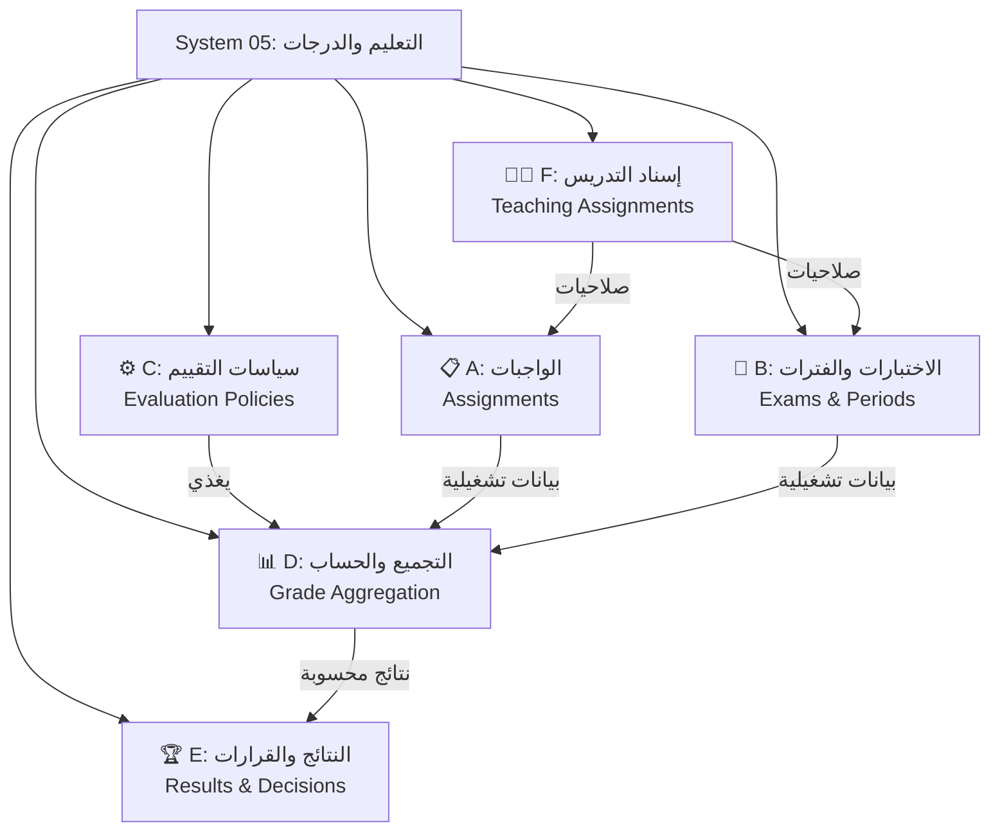
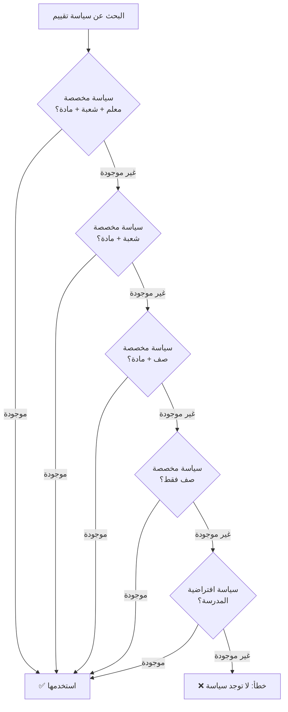

# خطة إعادة هيكلة نظام التعليم والدرجات (System 05) – شاملة

## الهدف

إعادة تنظيم نظام التعليم والدرجات من نظام كبير متشعب إلى **أنظمة فرعية مستقلة ومنظمة**، مع تحقيق:
1. **مرونة كاملة**: لا قيم ثابتة في الكود – كل شيء قابل للتخصيص
2. **فصل واضح**: كل نظام فرعي له مجلد ومسؤولية محددة
3. **قابلية التوسع**: إضافة مكونات جديدة بدون تعديل كود

---

## التشخيص الحالي – ملخص المشاكل

> [!CAUTION]
> النظام الحالي **يعمل** لكنه يحمل افتراضات ثابتة تمنع المرونة بين المدارس

### المشاكل المؤكدة في الكود:

| # | المشكلة | الموقع | الأثر |
|---|---------|--------|-------|
| 1 | حقول ثابتة في [GradingPolicy](file:///C:/Users/mousa/Desktop/New%20folder/backend-frontend/backend/src/modules/monthly-grades/monthly-grades.service.ts#36-45) | `schema.prisma:2496-2501` | `maxExamScore`, `maxHomeworkScore`, `maxAttendanceScore`, `maxActivityScore`, `maxContributionScore` – تفرض 5 مكونات ثابتة |
| 2 | أعمدة ثابتة في [MonthlyGrade](file:///C:/Users/mousa/Desktop/New%20folder/backend-frontend/backend/src/modules/monthly-grades/monthly-grades.service.ts#222-1550) | `schema.prisma:2766-2771` | `attendanceScore`, `homeworkScore`, `activityScore`, `contributionScore`, `examScore` – تكرر نفس القالب الثابت |
| 3 | `AssessmentType` enum ثابت | `schema.prisma:190-198` | `MONTHLY, MIDTERM, FINAL, QUIZ, ORAL, PRACTICAL, PROJECT` – لا يمكن للمدرسة تعريف أنواع جديدة |
| 4 | `AnnualGrade` يفترض فصلين | `schema.prisma:2962-2963` | `semester1_total`, `semester2_total` – لا يدعم 3 فصول أو أكثر |
| 5 | قيم افتراضية في الخدمات | [monthly-grades.service.ts](file:///C:/Users/mousa/Desktop/New%20folder/backend-frontend/backend/src/modules/monthly-grades/monthly-grades.service.ts) | حسابات يدوية تفترض بنية محددة |
| 6 | خلط الأنظمة | 67 مجلد backend | الواجبات والاختبارات والسياسات والتجميع كله مخلوط في مستوى واحد |

---

## الحل: تقسيم إلى 6 أنظمة فرعية مستقلة



---

## المرحلة 1: إعادة هيكلة نموذج البيانات (Schema)

### 1.1 تحويل [GradingPolicy](file:///C:/Users/mousa/Desktop/New%20folder/backend-frontend/backend/src/modules/monthly-grades/monthly-grades.service.ts#36-45) إلى نموذج ديناميكي بالكامل

**الوضع الحالي:**
```
GradingPolicy → maxExamScore, maxHomeworkScore, maxAttendanceScore, maxActivityScore, maxContributionScore (ثابتة)
             → GradingPolicyComponent[] (ديناميكية لكن ثانوية)
```

**الوضع المستهدف:**
```
GradingPolicy → totalMaxScore, passingScore (فقط)
             → GradingPolicyComponent[] (المصدر الوحيد لتوزيع الدرجات)
```

#### [MODIFY] [schema.prisma](file:///C:/Users/mousa/Desktop/New%20folder/backend-frontend/backend/prisma/schema.prisma)

**الإزالة من [GradingPolicy](file:///C:/Users/mousa/Desktop/New%20folder/backend-frontend/backend/src/modules/monthly-grades/monthly-grades.service.ts#36-45):**
```diff
  model GradingPolicy {
    ...
-   maxExamScore         Decimal  @map("max_exam_score") @db.Decimal(6, 2)
-   maxHomeworkScore      Decimal  @map("max_homework_score") @db.Decimal(6, 2)
-   maxAttendanceScore   Decimal  @map("max_attendance_score") @db.Decimal(6, 2)
-   maxActivityScore     Decimal  @map("max_activity_score") @db.Decimal(6, 2)
-   maxContributionScore Decimal  @map("max_contribution_score") @db.Decimal(6, 2)
+   totalMaxScore        Decimal  @map("total_max_score") @db.Decimal(7, 2)
+   sectionId            String?  @map("section_id") @db.VarChar(191)
+   academicTermId       String?  @map("academic_term_id") @db.VarChar(191)
+   version              Int      @default(1)
    ...
  }
```

**الإضافات على `GradingPolicyComponent`:**
```diff
  model GradingPolicyComponent {
    ...
+   weight             Decimal?  @db.Decimal(5, 2)
+   autoSourceType     String?   @map("auto_source_type") @db.VarChar(50)
+   isRequired         Boolean   @default(true) @map("is_required")
    ...
  }
```

### 1.2 تحويل `AssessmentType` من Enum إلى جدول ديناميكي

#### [NEW] نموذج `AssessmentTypeLookup`

```prisma
model AssessmentTypeLookup {
  id          String    @id @default(cuid()) @db.VarChar(191)
  code        String    @unique @db.VarChar(50)
  name        String    @db.VarChar(120)
  description String?   @db.VarChar(255)
  category    String    @default("PERIOD") @db.VarChar(50) // PERIOD | EXAM | COMPONENT
  isSystem    Boolean   @default(false) @map("is_system")
  isActive    Boolean   @default(true) @map("is_active")
  createdAt   DateTime  @default(now()) @map("created_at")
  ...
  
  gradingPolicies GradingPolicy[]
  examPeriods     ExamPeriod[]
  
  @@map("lookup_assessment_types")
}
```

> ✅ تم التنفيذ جزئيًا: تمت إضافة نموذج `AssessmentTypeLookup` إلى مخطط Prisma، مع حقول ارتباط اختيارية في `GradingPolicy` و `ExamPeriod` لمواصلة دعم الكود الحالي مع قابلية التوسعة المستقبلية.


### 1.3 تحويل [MonthlyGrade](file:///C:/Users/mousa/Desktop/New%20folder/backend-frontend/backend/src/modules/monthly-grades/monthly-grades.service.ts#222-1550) إلى نموذج ديناميكي

**الوضع الحالي:**
```
MonthlyGrade → attendanceScore, homeworkScore, activityScore, contributionScore, examScore (ثابتة)
            → customComponentsScore (مجموع المكونات الديناميكية)
```

**الوضع المستهدف:**
```
PeriodGrade → periodTotal (فقط)
           → PeriodGradeComponent[] (كل المكونات ديناميكية)
```

#### [NEW] نموذج `PeriodGradeComponent` (بديل الأعمدة الثابتة)

```prisma
model PeriodGradeComponent {
  id                       String    @id @default(cuid()) @db.VarChar(191)
  monthlyGradeId           String    @map("monthly_grade_id") @db.VarChar(191)
  gradingPolicyComponentId String    @map("grading_policy_component_id") @db.VarChar(191)
  score                    Decimal   @default(0.00) @db.Decimal(6, 2)
  isAutoCalculated         Boolean   @default(false) @map("is_auto_calculated")
  notes                    String?   @db.VarChar(255)
  ...
  
  monthlyGrade           MonthlyGrade           @relation(...)
  gradingPolicyComponent GradingPolicyComponent @relation(...)
  
  @@unique([monthlyGradeId, gradingPolicyComponentId])
  @@map("period_grade_components")
}
```

### 1.4 تحويل `AnnualGrade` لدعم عدد فصول مرن

**الوضع الحالي:**
```
AnnualGrade → semester1_total, semester2_total (ثابت لـ 2 فصل)
```

**الوضع المستهدف:**
```
AnnualGrade → annualTotal (فقط)
           → AnnualGradeTerm[] (ديناميكي – موجود بالفعل! ✅)
```

> [!TIP]
> جدول `AnnualGradeTerm` **موجود بالفعل** في الـ Schema! لكن `semester1_total` و `semester2_total` ما زالا موجودين كحقول ثابتة ويجب إزالتهما تدريجيًا.

```diff
  model AnnualGrade {
    ...
-   semester1Total   Decimal  @map("semester1_total") @db.Decimal(7, 2)
-   semester2Total   Decimal  @map("semester2_total") @db.Decimal(7, 2)
+   semester1Total   Decimal? @map("semester1_total") @db.Decimal(7, 2)
+   semester2Total   Decimal? @map("semester2_total") @db.Decimal(7, 2)
    // AnnualGradeTerm[] هي المصدر الوحيد لدرجات الفصول
    ...
  }
```

> ✅ تم التنفيذ: الحقول `semester1Total` و `semester2Total` أصبحت اختيارية (nullable) في مخطط Prisma، مما يدعم عددًا مرنًا من الفصول عبر `AnnualGradeTerm`.


---

## المرحلة 2: إعادة تنظيم مجلدات Backend

### الهيكل الحالي (مسطح – 67 مجلد)
```
backend/src/modules/
├── grading-policies/
├── grading-policy-components/
├── exam-periods/
├── exam-assessments/
├── student-exam-scores/
├── homeworks/
├── homework-types/
├── student-homeworks/
├── monthly-grades/
├── monthly-custom-component-scores/
├── semester-grades/
├── annual-grades/
├── annual-results/
├── grading-reports/
├── grading-outcome-rules/
├── employee-teaching-assignments/
├── data-scope/
├── ... (50 مجلد آخر)
```

### الهيكل المستهدف (مُقسّم حسب النظام الفرعي)

```
backend/src/modules/
│
├── assignments/                          ← نظام فرعي A: الواجبات
│   ├── assignments.module.ts
│   ├── homework-types/                   ← أنواع الواجبات
│   │   ├── homework-types.module.ts
│   │   ├── homework-types.service.ts
│   │   ├── homework-types.controller.ts
│   │   └── dto/
│   ├── homeworks/                        ← الواجبات
│   │   ├── homeworks.module.ts
│   │   ├── homeworks.service.ts
│   │   ├── homeworks.controller.ts
│   │   └── dto/
│   └── student-homeworks/                ← تسليم الواجبات
│       ├── student-homeworks.module.ts
│       ├── student-homeworks.service.ts
│       ├── student-homeworks.controller.ts
│       └── dto/
│
├── exams/                                ← نظام فرعي B: الاختبارات
│   ├── exams.module.ts
│   ├── exam-periods/                     ← فترات الاختبارات
│   │   ├── exam-periods.module.ts
│   │   ├── exam-periods.service.ts
│   │   ├── exam-periods.controller.ts
│   │   └── dto/
│   ├── exam-assessments/                 ← بنود الاختبارات
│   │   ├── exam-assessments.module.ts
│   │   ├── exam-assessments.service.ts
│   │   ├── exam-assessments.controller.ts
│   │   └── dto/
│   └── student-exam-scores/              ← درجات الطلاب
│       ├── student-exam-scores.module.ts
│       ├── student-exam-scores.service.ts
│       ├── student-exam-scores.controller.ts
│       └── dto/
│
├── evaluation-policies/                  ← نظام فرعي C: سياسات التقييم
│   ├── evaluation-policies.module.ts
│   ├── grading-policies/                 ← السياسات
│   │   ├── grading-policies.module.ts
│   │   ├── grading-policies.service.ts
│   │   ├── grading-policies.controller.ts
│   │   └── dto/
│   ├── grading-policy-components/        ← مكونات السياسة
│   │   ├── grading-policy-components.module.ts
│   │   ├── grading-policy-components.service.ts
│   │   ├── grading-policy-components.controller.ts
│   │   └── dto/
│   ├── grading-outcome-rules/            ← قواعد النتائج
│   │   └── ...
│   └── assessment-type-lookups/          ← أنواع التقييم (ديناميكية) [NEW]
│       └── ...
│
├── grade-aggregation/                    ← نظام فرعي D: التجميع والحساب
│   ├── grade-aggregation.module.ts
│   ├── monthly-grades/                   ← المحصلة الشهرية
│   │   ├── monthly-grades.module.ts
│   │   ├── monthly-grades.service.ts      ← إعادة كتابة: حساب ديناميكي
│   │   ├── monthly-grades.controller.ts
│   │   └── dto/
│   ├── period-grade-components/          ← درجات المكونات [NEW]
│   │   └── ...
│   ├── semester-grades/                  ← نتائج الفصل
│   │   └── ...
│   └── annual-grades/                    ← نتائج العام
│       └── ...
│
├── results-decisions/                    ← نظام فرعي E: النتائج والقرارات
│   ├── results-decisions.module.ts
│   ├── annual-results/                   ← النتائج السنوية
│   │   └── ...
│   ├── promotion-decisions/              ← قرارات النقل
│   │   └── ...
│   └── grading-reports/                  ← التقارير
│       └── ...
│
├── teaching-assignments/                 ← نظام فرعي F: إسناد التدريس
│   ├── teaching-assignments.module.ts
│   ├── employee-teaching-assignments/
│   │   └── ...
│   ├── employee-section-supervisions/
│   │   └── ...
│   └── data-scope/
│       └── ...
│
├── ... (بقية المجلدات كما هي: auth, users, students, etc.)
```

> [!IMPORTANT]
> **استراتيجية النقل**: ننقل الملفات فقط (بدون تعديل محتوى). نحافظ على نفس اسماء API endpoints وكل DTO's. يجب إبقاء ملفات [.module.ts](file:///C:/Users/mousa/Desktop/New%20folder/backend-frontend/backend/src/app.module.ts) كـ barrel modules.

---

## المرحلة 3: إعادة تنظيم مجلدات Frontend

### الهيكل المستهدف

```
frontend/src/features/
│
├── assignments/                              ← نظام فرعي A
│   ├── homework-types/
│   ├── homeworks/
│   └── student-homeworks/
│
├── exams/                                    ← نظام فرعي B
│   ├── exam-periods/
│   ├── exam-assessments/
│   └── student-exam-scores/
│
├── evaluation-policies/                      ← نظام فرعي C
│   ├── grading-policies/
│   ├── grading-policy-components/
│   └── grading-outcome-rules/
│
├── grade-aggregation/                        ← نظام فرعي D
│   ├── monthly-grades/
│   ├── monthly-custom-component-scores/
│   ├── semester-grades/
│   └── annual-grades/
│
├── results-decisions/                        ← نظام فرعي E
│   ├── annual-results/
│   └── grading-reports/
│
├── teaching-assignments/                     ← نظام فرعي F
│   ├── employee-teaching-assignments/
│   └── employee-section-supervisions/
│
├── ... (بقية المجلدات: auth, students, employees, etc.)
```

---

## المرحلة 4: إعادة كتابة محرك الحساب (Grade Aggregation Engine)

### 4.1 المحصلة الشهرية – من ثابت إلى ديناميكي

**الوضع الحالي في [monthly-grades.service.ts](file:///C:/Users/mousa/Desktop/New%20folder/backend-frontend/backend/src/modules/monthly-grades/monthly-grades.service.ts):**
```typescript
// حساب ثابت – كل مكون له عمود خاص
const monthlyTotal = attendanceScore + homeworkScore + 
                     activityScore + contributionScore + 
                     customComponentsScore + examScore;
```

**الوضع المستهدف:**
```typescript
// حساب ديناميكي – يقرأ المكونات من السياسة
const components = policy.components.filter(c => c.includeInMonthly);
let total = 0;
for (const comp of components) {
  const score = await this.resolveComponentScore(comp, enrollment, period);
  await this.upsertPeriodGradeComponent(monthlyGradeId, comp.id, score);
  total += score;
}
monthlyGrade.monthlyTotal = total;
```

### 4.2 المحصلة الفصلية – من افتراض ثابت إلى قراءة من البيانات

- الحساب الفصلي يقرأ **الأشهر الفعلية المعرفة** في [AcademicMonth](file:///C:/Users/mousa/Desktop/New%20folder/backend-frontend/backend/src/modules/monthly-grades/monthly-grades.service.ts#1062-1088) 
- قواعد التحويل (scale conversion) تأتي من السياسة

### 4.3 المحصلة السنوية – من فصلين إلى أي عدد

- الحساب يقرأ **الفصول الفعلية** من `AcademicTerm`
- الأوزان تأتي من جدول إعدادات جديد `TermWeightConfig`
- لا افتراض `× 2` أو `sequence === 1`

---

## المرحلة 5: نظام الوراثة والتخصيص (Policy Scope & Inheritance)

### ترتيب البحث عن سياسة



### التنفيذ

إضافة حقول نطاق (scope) على [GradingPolicy](file:///C:/Users/mousa/Desktop/New%20folder/backend-frontend/backend/src/modules/monthly-grades/monthly-grades.service.ts#36-45):

```diff
  model GradingPolicy {
    ...
    gradeLevelId     String    @map("grade_level_id")
    subjectId        String    @map("subject_id")
+   sectionId        String?   @map("section_id")        // null = كل الشعب
+   teacherEmployeeId String?  @map("teacher_employee_id") // null = كل المعلمين
+   academicTermId   String?   @map("academic_term_id")   // null = كل الفصول
    isDefault        Boolean   @default(false)
    ...
  }
```

### خدمة البحث عن السياسة (Policy Resolution)

#### [NEW] ملف `evaluation-policies/services/policy-resolver.service.ts`

```typescript
@Injectable()
export class PolicyResolverService {
  async resolvePolicy(context: {
    academicYearId: string;
    gradeLevelId: string;
    subjectId: string;
    sectionId?: string;
    teacherEmployeeId?: string;
    academicTermId?: string;
  }): Promise<GradingPolicy> {
    // بحث تدريجي من الأكثر تخصيصًا إلى الأقل
    // 1. معلم + شعبة + مادة + فصل
    // 2. شعبة + مادة + فصل
    // 3. صف + مادة + فصل
    // 4. صف + فصل
    // 5. سياسة افتراضية (isDefault = true)
  }
}
```

---

## المرحلة 6: الحوكمة والتدقيق

- ✅ **محفوظة كما هي** – النظام الحالي ممتاز في: القفل، الاعتماد، RBAC، DataScope
- يُضاف: ربط كل نتيجة محسوبة بـ `gradingPolicyId` + `version` لتتبع أي سياسة استُخدمت

---

## استراتيجية الترحيل (Migration Strategy)

> [!WARNING]
> **لا نحذف البيانات القديمة!** نضيف الحقول الجديدة وننقل البيانات تدريجيًا.

### خطوات الترحيل:

| الخطوة | الوصف | النوع |
|--------|-------|-------|
| 1 | إضافة جدول `AssessmentTypeLookup` + ترحيل قيم Enum الحالية | Migration |
| 2 | إضافة `totalMaxScore`, `version`, `sectionId`, `academicTermId` على [GradingPolicy](file:///C:/Users/mousa/Desktop/New%20folder/backend-frontend/backend/src/modules/monthly-grades/monthly-grades.service.ts#36-45) | Migration |
| 3 | ترحيل `maxExamScore + maxHomework + ...` → `GradingPolicyComponent` records | Data Migration Script |
| 4 | إضافة جدول `PeriodGradeComponent` | Migration |
| 5 | ترحيل أعمدة [MonthlyGrade](file:///C:/Users/mousa/Desktop/New%20folder/backend-frontend/backend/src/modules/monthly-grades/monthly-grades.service.ts#222-1550) الثابتة → `PeriodGradeComponent` records | Data Migration Script |
| 6 | جعل أعمدة `semester1_total`, `semester2_total` اختيارية (nullable) | Migration |
| 7 | ترحيل بيانات `semester1_total/2` → `AnnualGradeTerm` (إذا لم تكن موجودة) | Data Migration Script |
| 8 | نقل ملفات Backend حسب الهيكل الجديد + تحديث imports | Refactor |
| 9 | نقل ملفات Frontend حسب الهيكل الجديد + تحديث imports | Refactor |
| 10 | إعادة كتابة محرك الحساب الشهري/الفصلي/السنوي | Code Change |

---

## ترتيب التنفيذ المقترح

| المرحلة | الأولوية | التقدير | يعتمد على |
|---------|----------|---------|-----------|
| 1: إعادة هيكلة Schema | 🔴 عالية | 2-3 أيام | – |
| 2: إعادة تنظيم Backend | 🟠 عالية | 1-2 يوم | المرحلة 1 |
| 3: إعادة تنظيم Frontend | 🟠 عالية | 1-2 يوم | المرحلة 2 |
| 4: محرك الحساب | 🔴 عالية | 3-4 أيام | المرحلة 1+2 |
| 5: الوراثة والتخصيص | 🟡 متوسطة | 2-3 أيام | المرحلة 1 |
| 6: الحوكمة | 🟢 منخفضة | 1 يوم | المرحلة 4 |

---

## القرارات التي تحتاج اعتمادك

> [!IMPORTANT]
> أحتاج رأيك في النقاط التالية قبل البدء بالتنفيذ:

1. **هل نبدأ بإعادة تنظيم المجلدات أولاً (بدون تغيير كود) أم نبدأ بتعديل Schema؟**
   - **خيار أ**: ننقل الملفات أولاً (أقل مخاطرة) ثم نعدل المنطق
   - **خيار ب**: نعدل Schema والمنطق أولاً ثم ننقل الملفات

2. **هل تريد الحفاظ على التوافق العكسي (backward compatibility) مع البيانات القديمة؟**
   - إذا نعم: نترك الأعمدة القديمة `deprecated` بدون حذف
   - إذا لا: نحذف مباشرة بعد ترحيل البيانات

3. **هل نسمح بتخصيص سياسة على مستوى المعلم؟**
   - حسب وثيقة [15_GRADING_POLICY_PLANNING.md](file:///C:/Users/mousa/Desktop/New%20folder/backend-frontend/docs/15_GRADING_POLICY_PLANNING.md) – السؤال مطروح

4. **هل الأولوية الآن للمرونة الكاملة أم للتنظيم والترتيب فقط؟**
   - **خيار أ**: نسوي التنظيم بس (نقل ملفات + تنظيف) – أسرع
   - **خيار ب**: نسوي التنظيم + إعادة الهيكلة الكاملة (schema + engine) – أشمل لكن أطول

---

## خطة التحقق (Verification Plan)

### تحقق آلي
- تشغيل `npx prisma validate` للتأكد من صحة الـ Schema بعد كل تعديل
- تشغيل `npx prisma generate` للتأكد من توليد Prisma Client
- تشغيل `npm run build` في Backend للتأكد من عدم وجود أخطاء TypeScript
- تشغيل `npm run build` في Frontend للتأكد من صحة imports بعد نقل الملفات

### تحقق يدوي
- مراجعة بنية المجلدات الجديدة والتأكد من وضوح الفصل
- التأكد من أن كل API endpoint ما زال يعمل (نفس URLs)
- مراجعة الخطة معك والاتفاق على القرارات المعلقة
